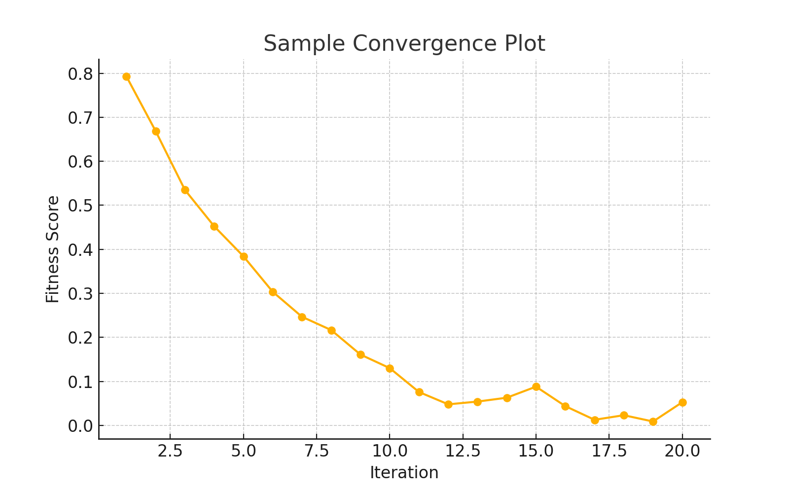

# MRFO with Lévy Flight for Medical Image Classification


## 📋 Overview
This repository implements a Modified Manta Ray Foraging Optimization (MRFO) algorithm enhanced with Lévy Flight for optimizing hyperparameters in medical image classification. The model classifies skin cancer images (malignant vs. benign) using transfer learning with VGG19.

## 🌟 Features
- MRFO with Lévy flight for exploration
- Automatic hyperparameter tuning (data augmentation + training)
- Transfer learning with VGG19
- Visualization and statistical evaluation

## 🔧 Installation

```bash
git clone https://github.com/Shamsu3100/MRFO-Levy
cd MRFO-Levy
pip install -r requirements.txt
```

> ⚠️ Recommended Python version: 3.7–3.10  
> 💡 Training may take 30+ minutes. Use a GPU-enabled machine for faster execution.

## 📊 Dataset

The model expects a folder structure like:
```
dataset/
  ├── malignant/
  │   ├── image1.jpg
  │   └── ...
  └── benign/
      ├── image1.jpg
      └── ...
```

> 📥 **Note**: You may use public datasets like [ISIC Archive](https://www.isic-archive.com/) or your own labeled set.

## 🏃‍♀️ Usage

Place your data in the `dataset/` folder and run:
```bash
python MRFO_Levy.py
```

## 🗃 Output Files

| File | Description |
|------|-------------|
| `BestSolutions.csv` | Logs of best solution found at each iteration |
| `Population.csv`    | Logs of population evolution |
| `Checkpoints/`      | Saved model weights (HDF5 format) |
| `Logs/`             | Training logs (CSV) |

## 📈 Sample Output



## ⚙️ Hyperparameters Optimized

| Parameter Group | Parameters | Range |
|----------------|------------|-------|
| Data Augmentation | Rotation | 0–10 |
|                  | Width Shift | 0–0.10 |
|                  | Height Shift | 0–0.10 |
|                  | Zoom | 0–0.10 |
|                  | Shear | 0–0.10 |
|                  | Horizontal Flip | True/False |
|                  | Vertical Flip | True/False |
| Model Training | Optimizer | Adam, Nadam, RMSprop, Adadelta, Adagrad, SGD |
|                | Batch Size | 8, 16, 32, 64 |
|                | Transfer Learning Ratio | 0–25 |

## ⚙️ Algorithm Configuration
- Population size: 10
- Iterations: 20
- Independent runs: 2
- Early stopping patience: 10

## 📁 Project Structure

```
MRFO_Levy/
├── MRFO_Levy.py             # Main implementation script
├── dataset/                 # Medical image dataset directory
│   ├── malignant/
│   └── benign/
├── Checkpoints/             # Model checkpoints
├── Logs/                    # Training logs
├── results/                 # Sample output images
│   └── convergence.png
├── BestSolutions.csv        # Records best solutions found
├── Population.csv           # Records population evolution
├── requirements.txt         # Dependencies
└── README.md                # This file
```

## 🛠 Dependencies
- tensorflow >= 2.0.0
- numpy
- opencv-python
- scikit-learn
- scipy
- matplotlib
- pandas

## 📝 Citation
If you use this implementation in your research, please cite:
```
@article{MRFO_Levy_2025,
  title={Adaptive Hybrid Hyperparameter Optimization with MRFO and Lévy Flight for Accurate Melanoma Classification},
  author={Shamsuddeen Adamu},
  journal={Journal of King Saud University-Computer and Information Sciences},
  year={2025}
}
```

## 🔒 License
This project is licensed under the MIT License - see the LICENSE file for details.

## 📧 Contact
For questions or clarifications, please open an issue in this repository.